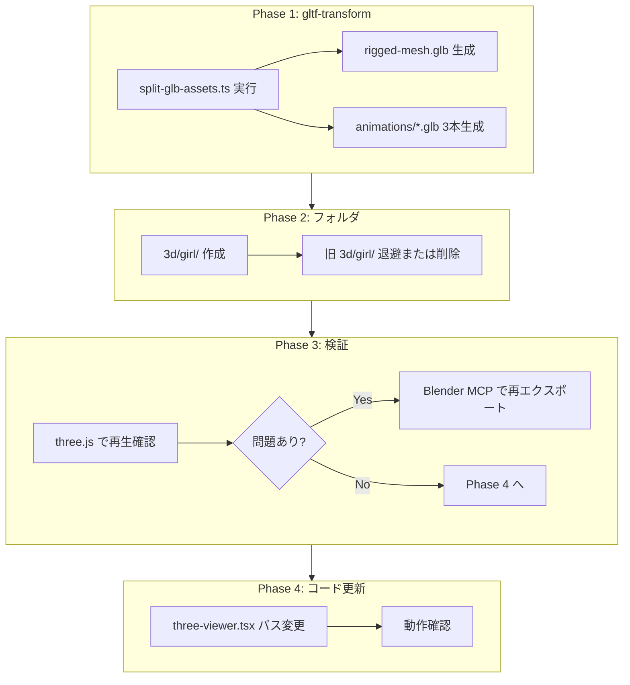

# 3Dモデルロード最適化: スクリプトによる分離とフォルダ再構成

## 現状分析

| 項目             | 値                                                 |
| ---------------- | -------------------------------------------------- |
| 読み込みファイル | 3個のGLB（いずれも mesh + skeleton + 1 animation） |
| 各ファイルサイズ | 約14MB                                             |
| 合計ダウンロード | **約42MB**                                         |
| 初回ロード時間   | 約10秒                                             |
| 現パス           | `public/3d/girl/Animation_*_withSkin.glb`          |

## GLB 内部構造（`gltf-transform inspect` による検証結果）

3ファイルとも同一構造（Khronos glTF Blender I/O v4.0.43 出力）:

| 要素           | 内容                                                                 |
| -------------- | -------------------------------------------------------------------- |
| シーン root    | `Armature`                                                           |
| メッシュ       | `char1`／33,093 vertices／1.93 MB／JOINTS_0, WEIGHTS_0（スキニング） |
| マテリアル     | `Material_1`／baseColorTexture, emissiveTexture                      |
| テクスチャ     | 2枚／各 2048x2048 PNG／各 6.54 MB（合計 ~13 MB）                     |
| アニメーション | 72 channels／各ファイルで名称のみ相違                                |

**14MB の内訳:**

- テクスチャ: 2 × 6.54 MB ≒ **13 MB**
- メッシュ: **1.93 MB**
- アニメーション: **92〜138 KB**

**アニメーション詳細:**

| ファイル         | アニメ名 | duration         | keyframes | サイズ |
| ---------------- | -------- | ---------------- | --------- | ------ |
| Idle_7           | Armature | Idle_7           | baselayer | 9s     |
| Mirror_Viewing   | Armature | Mirror_Viewing   | baselayer | 7s     |
| Chair_Sit_Idle_F | Armature | Chair_Sit_Idle_F | baselayer | 11s    |

→ アニメーションのみ抽出した場合、**各ファイル 100〜200 KB 程度**（テクスチャ・メッシュ削除により約 **99% 削減**）

## 最適化方針

```
現状:  3 × 14MB = 42MB
目標:  rigged-mesh.glb 14MB + (idle + mirror + sit) ≒ 0.33MB ≒ 14.3MB 合計
```

## 目標ディレクトリ構造

```
public/
  3d/
    girl/
      rigged-mesh.glb          ← モデル1つ（メッシュ＋リグ、アニメなし）
      animations/
        idle.glb               ← アニメーション3つ（スケルトン＋キーフレームのみ）
        mirror.glb
        sit.glb
```

---

## Phase 1: gltf-transform スクリプトによる抽出

**前提**: `@gltf-transform/core`, `@gltf-transform/extensions`, `@gltf-transform/functions` は既に devDependencies に含まれている。

### 1.1 ベースモデル抽出

入力: `Animation_Idle_7_withSkin.glb` → 出力: `rigged-mesh.glb`

1. `NodeIO` で GLB を読み込み（`KHRONOS_EXTENSIONS` を register）
2. `document.getRoot().listAnimations()` をループし、各 `anim.dispose()` で削除
3. `document.transform(prune())` で未参照リソースを削除
4. `io.write(path, doc)` で `public/3d/girl/rigged-mesh.glb` に保存

### 1.2 アニメーション抽出

各 `*_withSkin.glb` を処理。メッシュ・テクスチャを削除し、スケルトン＋アニメーションのみ残す。

glTF ではメッシュは Node の `mesh` 参照で保持されている。`prune()` は「Scene から参照されていない」リソースのみ削除するため、**まず Node から mesh を切り離す**必要がある。

```typescript
import { NodeIO } from "@gltf-transform/core";
import { KHRONOS_EXTENSIONS } from "@gltf-transform/extensions";
import { prune } from "@gltf-transform/functions";

// アニメーション抽出: Node から mesh を切り離す → prune
for (const node of document.getRoot().listNodes()) {
  if (node.getMesh()) node.setMesh(null);
}
await document.transform(prune());
```

- `node.setMesh(null)`: ノードからメッシュ参照を解除
- `prune()`: 未参照の mesh / material / texture / accessor を削除
- アニメーションが参照するスケルトンノード（Armature 階層）は Scene に含まれるため保持される

### 1.3 スクリプト処理フロー

1. `fs.mkdir("public/3d/girl/animations/", { recursive: true })`
2. Idle を読み込み → アニメーション削除 → `rigged-mesh.glb` 出力
3. `[idle, mirror, sit]` の各入力ファイルを読み込み → `node.setMesh(null)` → prune → `animations/{name}.glb` 出力

擬似コード:

```typescript
import path from "path";
import { NodeIO } from "@gltf-transform/core";
import { KHRONOS_EXTENSIONS } from "@gltf-transform/extensions";
import { prune } from "@gltf-transform/functions";

const io = new NodeIO().registerExtensions(KHRONOS_EXTENSIONS);
const base = path.join(process.cwd(), "public/3d/girl");

// 1. ベースモデル
let doc = await io.read(path.join(base, "Animation_Idle_7_withSkin.glb"));
for (const a of doc.getRoot().listAnimations()) a.dispose();
await doc.transform(prune());
await io.write(path.join(base, "rigged-mesh.glb"), doc);

// 2. アニメーション3本
for (const [src, out] of [
  ["Animation_Idle_7_withSkin.glb", "idle.glb"],
  ["Animation_Mirror_Viewing_withSkin.glb", "mirror.glb"],
  ["Animation_Chair_Sit_Idle_F_withSkin.glb", "sit.glb"],
]) {
  doc = await io.read(path.join(base, src));
  for (const node of doc.getRoot().listNodes()) {
    if (node.getMesh()) node.setMesh(null);
  }
  await doc.transform(prune());
  await io.write(path.join(base, "animations", out), doc);
}
```

### 1.4 入力・出力マッピング

| 入力                                      | 出力                    | 処理                       |
| ----------------------------------------- | ----------------------- | -------------------------- |
| `Animation_Idle_7_withSkin.glb`           | `rigged-mesh.glb`       | アニメーション削除         |
| `Animation_Idle_7_withSkin.glb`           | `animations/idle.glb`   | Node.setMesh(null) + prune |
| `Animation_Mirror_Viewing_withSkin.glb`   | `animations/mirror.glb` | 同上                       |
| `Animation_Chair_Sit_Idle_F_withSkin.glb` | `animations/sit.glb`    | 同上                       |

### 1.5 スクリプト実行と package.json

```bash
bun run scripts/split-glb-assets.ts
```

`package.json` に `"split:glb": "bun run scripts/split-glb-assets.ts"` を追加。

---

## Phase 2: フォルダ再構成

### 2.1 ディレクトリ作成

スクリプト内で次のディレクトリを作成:

- `public/3d/girl/`
- `public/3d/girl/animations/`

### 2.2 旧アセットの扱い

- 抽出完了後、`public/3d/girl/` 内の元ファイルは削除するか、`3d/girl/archive/` に退避
- three-viewer の参照先は `3d/girl/` に変更するため、旧パスは不要

---

## Phase 3: Blender MCP による検証・フォールバック（オプション）

gltf-transform の出力が three.js で正しく再生されない場合、Blender MCP で検証・再エクスポートする。

### 3.1 前提

- Blender 3.0+ を起動し、Blender MCP アドオンを有効化
- Cursor の MCP 設定に blender を追加（`.cursor/mcp.json` または Settings > MCP）
- Blender 側で「Connect to Claude」を有効化

### 3.2 検証用 MCP コマンド例

`execute_blender_code` で以下を実行可能:

1. **GLB インポート確認**

```python
   bpy.ops.import_scene.gltf(filepath='...')


```

1. **アニメーション＋アーマチュアのみエクスポート**（メッシュ非表示・非エクスポート）

```python
   bpy.ops.export_scene.gltf(filepath='...', export_animations=True, export_skins=True, ...)


```

### 3.3 フォールバック手順

gltf-transform 出力でスケルトン参照が崩れる場合:

1. Blender で元の `*_withSkin.glb` をインポート
2. メッシュを削除（または非表示にしてエクスポート対象外に）
3. アーマチュア＋アニメーションのみで glTF エクスポート
4. 出力を `3d/girl/animations/*.glb` に保存

---

## Phase 4: three-viewer.tsx の更新

`[src/components/three-viewer.tsx](src/components/three-viewer.tsx)` を新パスに対応させる。

### 1. パス定義の分割

```typescript
const MODEL_PATH = "/3d/girl/rigged-mesh.glb";
const ANIM_PATHS = {
  idle: "/3d/girl/animations/idle.glb",
  mirror: "/3d/girl/animations/mirror.glb",
  sit: "/3d/girl/animations/sit.glb",
} as const;
```

### 2. ロードロジックの変更

- モデルは `useGLTF(MODEL_PATH)` で1回だけ読み込み
- アニメーションは `useGLTF` で3ファイル読み込み（Suspense は並列ロードで対応）
- 描画は `modelGltf.scene` のみを使用
- `allClips` は各アニメーション GLB の `gltf.animations[0]` から生成
- `useAnimations(allClips, groupRef)` はそのまま利用

### 3. フォールバック・先行読み込み

- `useGLTF.preload(MODEL_PATH)` と各 `ANIM_PATHS` を preload
- モデルを先に表示し、アニメーションは順次適用する（または `Promise.all` 相当で一括ロード）
- mesh 設定用 `useEffect` は `modelGltf.scene` に変更

### 4. ロード順序戦略（UX 改善）

- **優先**: モデルのみ先に表示 → 続けてアニメーションを適用
- モデルとアニメーションを別 Suspense で分けるか、`useGLTF` の並列読み込みで「モデル完了時点で表示、アニメーションは後からブレンド」とする

## 実行フロー概要



## 見込み効果

| 項目           | 現状  | 最適化後                                 |
| -------------- | ----- | ---------------------------------------- |
| 総ダウンロード | ~42MB | ~14.3MB（モデル14MB + アニメ合計0.33MB） |
| 初回ロード     | ~10秒 | ~2–3秒                                   |
| リクエスト数   | 3     | 4（モデル1 + アニメ3）                   |

## 注意事項

- **スケルトン互換性**: 3つの元GLBは同一キャラ（同一スケルトン）である前提。gltf-transform で分離してもボーン参照は保持される
- **gltf 仕様**: アニメーションのみの GLB でも、アニメが参照するノード（スケルトン階層）は必須で残る。メッシュ削除後も valid な glTF として出力可能
- **Blender MCP**: Blender が起動していないと MCP は使えない。検証・フォールバック時のみ使用
