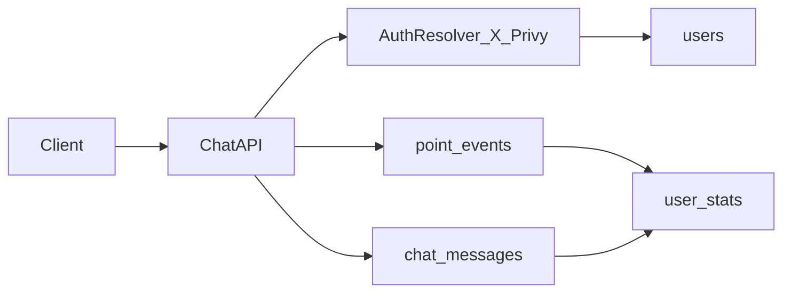

# D1 + Drizzle 最小永続層計画

## 目的

- `users` / `point`管理 / `messages` を最小構成で永続化する。
- あなたの回答を反映し、`users` は **外部認証（X/Privy）前提**、wallet は初期は `**users.wallet_address` 1本で開始する。
- pointは **履歴 + 現在値** の両方を持ち、読み取り効率と監査性を両立する。

## 既存実装との接続ポイント

- 現在の会話は `sessionId` ベースで動いているため、初期段階はこれを会話単位キーとして活かす。
- 根拠ファイル:
  - [chat usecase](src/usecase/chat.ts)
  - [game session entity](src/domain/entities/game-session.ts)
  - [chat schema](src/interfaces/schemas/chat.ts)

```46:74:src/usecase/chat.ts
async chat(sessionId: string, message: string, locale: Locale): Promise<ChatResult> {
  const session = this.repo.findById(sessionId);
  // ...
  const { message: reply, score: rawScore, emotion } = await this.ai.sendMessage(
    sessionId,
    session.characterType,
    session.username,
    message,
    locale,
  );
  const score = Score.fromRaw(rawScore);
  session.incrementMessageCount();
  return { reply, score, emotion, isGameOver: false };
}
```

## テーブル設計（最小DRY）

- `users`
  - 主キー: `id` (UUID text)
  - 一意キー: `(auth_provider, auth_provider_user_id)`
  - 列: `display_name`, `wallet_address`, `created_at`, `updated_at`
  - 意図: X/Privyの外部IDを正として、内部IDは参照安定化に使う。
- `chat_messages`
  - 主キー: `id` (UUID text)
  - 外部キー: `user_id -> users.id`
  - 列: `session_id`, `role` (`user|agent|system`), `content`, `score_raw`, `score_adjusted`, `emotion`, `created_at`
  - インデックス: `(user_id, session_id, created_at)`
  - 意図: 会話履歴とスコア文脈を1テーブルで回収し、DRYに運用。
- `point_events`
  - 主キー: `id` (UUID text)
  - 外部キー: `user_id -> users.id`
  - 列: `session_id`, `message_id`(nullable), `delta`, `reason`, `metadata_json`, `created_at`
  - インデックス: `(user_id, created_at)`
  - 意図: 監査可能なpoint加減算履歴。
- `user_stats`
  - 主キー/外部キー: `user_id -> users.id`
  - 列: `total_points`, `intimacy_level`, `last_message_at`, `updated_at`
  - 意図: 画面表示やランキング用の高速参照スナップショット。

## 実装ステップ

1. D1/Drizzle基盤を追加

- [wrangler config](wrangler.toml) に `[[d1_databases]]` を追加
- `drizzle-orm`, `drizzle-kit` を導入し、`drizzle.config.ts` を追加

1. スキーマ定義を追加

- 追加先: [src/db](src/db) 配下
- `users`, `chat_messages`, `point_events`, `user_stats` をDrizzleで定義

1. 初期migrationを生成

- SQL migration（D1/SQLite方言）を生成
- 一意制約・FK・主要indexを含める

1. DB接続ユーティリティを追加

- Cloudflare envの `DB` バインディングからDrizzleクライアントを返す共通関数を追加

1. 最小の動作確認

- user upsert
- message insert
- point event insert + user_stats更新（トランザクション）

## データフロー（初期）



## 受け入れ基準

- D1に4テーブルが作成される（FK/UNIQUE/INDEX込み）。
- 同一外部アカウントで重複ユーザーが作られない。
- 1回のメッセージ処理で `chat_messages` と `point_events` が記録され、`user_stats.total_points` が整合する。
- 既存の `sessionId` ベースAPI仕様を壊さない。
