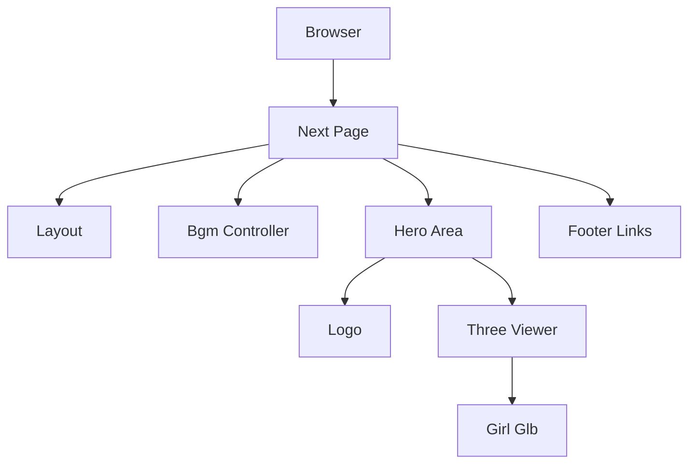
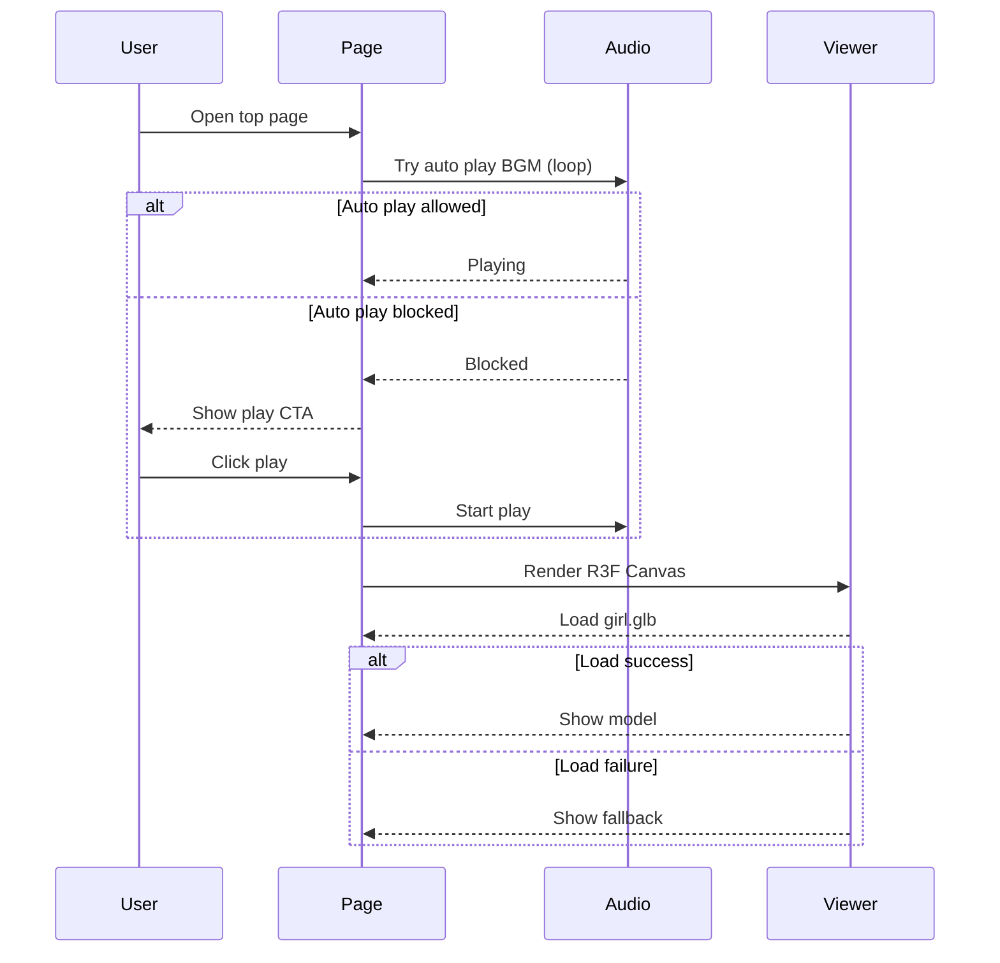

# Design Document

## Overview

本Designは、恋愛シミュレーションゲーム「marry.fun」の簡易LP（トップページ）を実装するための技術設計を定義します。LPは全画面背景（`public/bg.png`）の上に、上部にサイト名、中央に3Dモデル（`public/girl.glb`）、下部に「Coming soon…」と外部リンクを配置し、BGMをループ再生することで“ギャルゲー風”の雰囲気を提供します。

対象ユーザーは初回訪問者・ライトユーザーであり、1画面で世界観を理解できること、表示や音声が失敗しても体験が破綻しないことを重視します。

### Goals

- 1画面完結のLPを提供し、背景・タイポ・装飾で“ギャルゲー風”の第一印象を作る
- `use-sound` によるBGMループ再生（自動再生制限に対する導線を含む）
- R3F（`@react-three/fiber`）で `public/girl.glb` をファーストビュー中央に描画
- 失敗時フォールバック、`prefers-reduced-motion`、基本的なパフォーマンス配慮

### Non-Goals

- 複数ページ化、アカウント/課金、ゲーム本編への導線設計の最適化
- 3Dモデルの制作・最適化（ポリゴン削減/テクスチャ圧縮）そのもの
- 高度な3Dインタラクション（ドラッグ回転等）や物理演算

## Architecture

### Existing Architecture Analysis

- Next.js App Router（`src/app/`）構成
- Tailwind CSS（`src/app/globals.css`で`@import "tailwindcss";`）
- 既存依存に `use-sound` は存在するが、R3F/three系は未導入

### Architecture Pattern & Boundary Map

単一ページ内でのUI合成が中心のため、**ページコンポーネント＋小さなUI部品＋表示専用の3Dビューワ**に責務を分離します。

**Key Decisions**

- 3D描画はR3FのCanvasを「中央ヒーロー領域」に限定し、背景やテキストは通常DOMで重ねる
- 3D読み込み失敗時でもLP全体は成立する（Viewerのみフォールバック）
- `prefers-reduced-motion` が有効な場合は、ロゴ/3Dの自動アニメーションを抑制する

### Technology Stack

| Layer      | Choice / Version             | Role in Feature          | Notes                    |
| ---------- | ---------------------------- | ------------------------ | ------------------------ |
| Frontend   | Next.js（既存）              | LPページ                 | `src/app/page.tsx`       |
| UI Styling | Tailwind CSS（既存）         | レイアウト/装飾          | 背景はCSSで全画面        |
| Audio      | `use-sound`（既存）          | BGMループ再生            | 自動再生制限に備えた導線 |
| 3D         | `@react-three/fiber`（追加） | Canvas描画               | R3F                      |
| 3D Utility | `@react-three/drei`（追加）  | glTF読み込み/環境/ローダ | 採用可否は実装時に確定   |
| 3D Core    | `three`（追加）              | R3F基盤                  | 依存として必要           |

## System Flows

## Requirements Traceability

| Requirement | Summary             | Components              | Interfaces | Flows        |
| ----------- | ------------------- | ----------------------- | ---------- | ------------ |
| 1           | LPファーストビュー  | `LandingPage`           | State      | -            |
| 2           | BGMループ再生       | `BgmController`         | State      | System Flows |
| 3           | ロゴふわっと        | `Logo`                  | -          | -            |
| 4           | 全画面背景          | `Background`            | -          | -            |
| 5           | ヘッダー/フッター   | `Header`, `FooterLinks` | -          | -            |
| 6           | 品質/フォールバック | 全体                    | State      | System Flows |
| 7           | 3Dモデル表示        | `ThreeViewer`           | State      | System Flows |

## Components and Interfaces

### UI

| Component       | Domain/Layer | Intent              | Req Coverage  | Key Dependencies (P0/P1)               | Contracts |
| --------------- | ------------ | ------------------- | ------------- | -------------------------------------- | --------- |
| `LandingPage`   | UI           | 画面全体の合成      | 1,2,3,4,5,6,7 | `BgmController`(P0), `ThreeViewer`(P0) | State     |
| `Background`    | UI           | `bg.png`全画面背景  | 4             | -                                      | -         |
| `Header`        | UI           | 上部に`marry.fun`   | 5             | -                                      | -         |
| `FooterLinks`   | UI           | Coming soon + Links | 5             | -                                      | -         |
| `Logo`          | UI           | ロゴ表示/アニメ     | 1,3           | -                                      | -         |
| `BgmController` | UI/Logic     | BGM制御と導線       | 2,6           | `use-sound`(P0)                        | State     |
| `ThreeViewer`   | UI/3D        | `girl.glb`表示      | 7,6           | R3F/three(P0)                          | State     |

#### BgmController

| Field             | Detail                                  |
| ----------------- | --------------------------------------- |
| Intent            | BGMの自動開始・ループ・失敗時導線を提供 |
| Requirements      | 2, 6                                    |
| Owner / Reviewers | -                                       |

**Responsibilities & Constraints**

- 自動再生を試みるが、失敗した場合はユーザー操作で開始できるUIを提供する
- 再生状態（再生中/停止中/ブロック）をUIに反映する

**Dependencies**

- External: `use-sound` — 音声再生（P0）

**Contracts**: Service [ ] / API [ ] / Event [ ] / Batch [ ] / State [x]

**State Management**

- State model: `isPlaying`, `isBlocked`, `error?`
- Persistence & consistency: 永続化なし（必要ならDesign外で検討）
- Concurrency strategy: 二重再生を防ぐ（単一インスタンス）

**Implementation Notes**

- Integration: `public/sound/...mp3` をloopで再生
- Validation: 自動再生ブロック時にCTAが出ること
- Risks: iOS Safari等の挙動差

#### ThreeViewer

| Field             | Detail                                                  |
| ----------------- | ------------------------------------------------------- |
| Intent            | R3F Canvas内で `public/girl.glb` を読み込み、中央に表示 |
| Requirements      | 7, 6                                                    |
| Owner / Reviewers | -                                                       |

**Responsibilities & Constraints**

- 3D表示はLPの中心演出だが、失敗してもページは成立させる
- `prefers-reduced-motion` 有効時は常時回転等の自動アニメを抑制する

**Dependencies**

- External: `@react-three/fiber` — Canvas描画（P0）
- External: `three` — 3D基盤（P0）
- External: `@react-three/drei` — ローダ/ヘルパ（P1）

**Contracts**: Service [ ] / API [ ] / Event [ ] / Batch [ ] / State [x]

**State Management**

- State model: `status`（loading/success/error）
- Persistence & consistency: 永続化なし
- Concurrency strategy: 同一ページで単一ロードに限定

**Implementation Notes**

- Integration: `public/girl.glb` を静的アセットとして読み込む
- Validation: 読み込み中/失敗時のUIが崩れない
- Risks: モデルサイズが大きい場合の初期描画遅延

## Error Handling

### Error Categories and Responses

- User Errors: 該当なし
- System Errors:
  - 音声自動再生ブロック → CTAを表示し、ユーザー操作で開始
  - 3Dモデル読み込み失敗 → ローディング/エラー表示に切り替え、LP自体は表示継続

## Testing Strategy

- Unit Tests:
  - `BgmController` の状態遷移（blocked/playing）
  - `ThreeViewer` のロード状態（loading/success/error）
- Integration Tests:
  - トップ表示→自動再生失敗→CTA→再生開始
  - 3D読み込み失敗時にフッター/ヘッダーが表示され続ける
- E2E/UI Tests:
  - ファーストビューで背景/ヘッダー/フッターが見える
  - `prefers-reduced-motion` 有効時のアニメ抑制

## Performance & Scalability

- 3Dモデルは初回ロードが支配的になるため、ローディング表示で体感を担保する
- Canvas領域を必要最小に留め、DOMレイヤーの再レンダリングがCanvasに波及しないように責務分離する

## Open Questions / Risks

- `X` / `Help` / `Docs` のリンクURL確定（未確定なら無効状態表現にする）
- `public/girl.glb` のサイズが大きい場合、初回表示体験に影響（圧縮/最適化は別検討）
