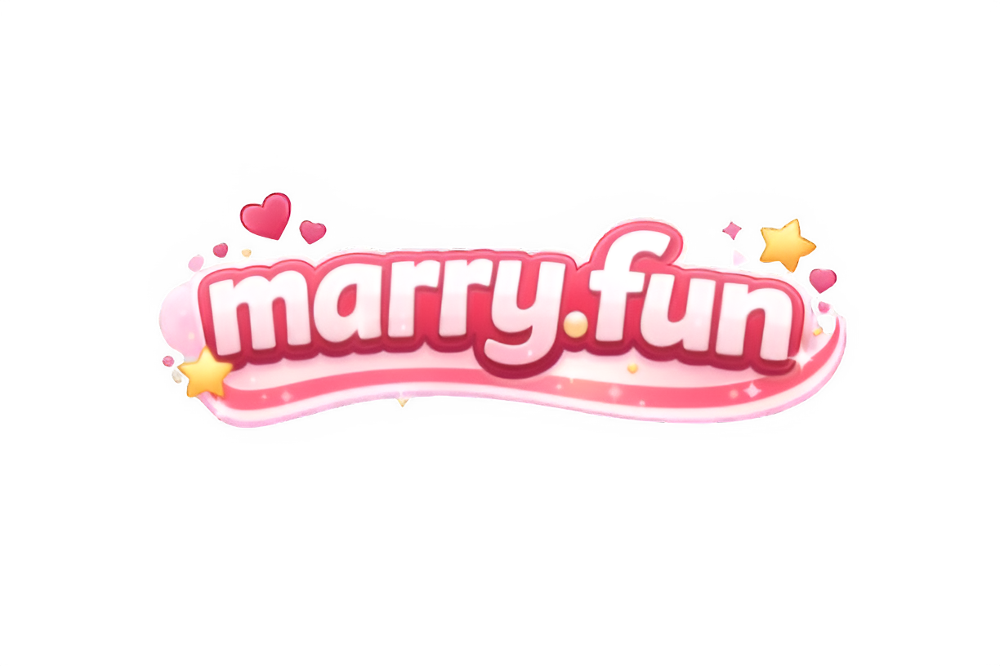
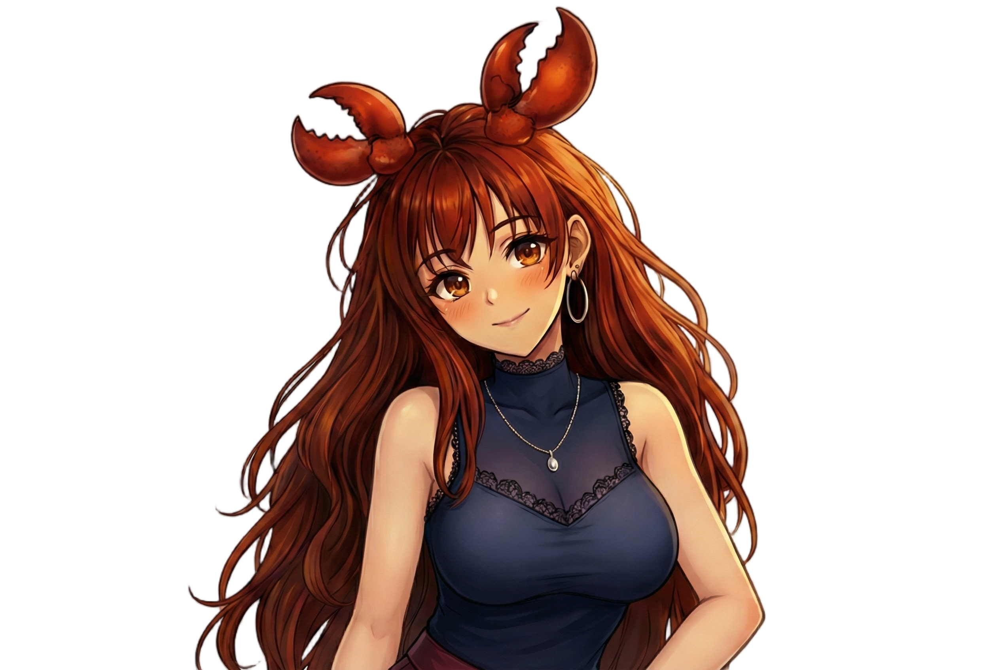
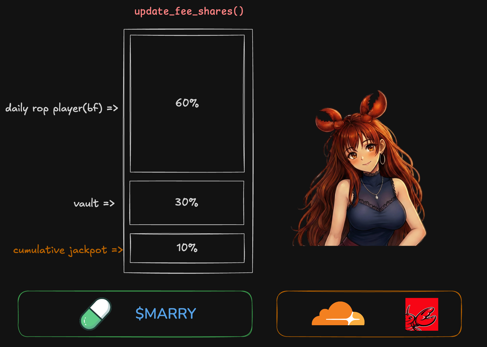

  

  

   
  

## About

`marry.fun` is an **on-chain romance game** with [**pump.fun fee sharing**](https://x.com/Pumpfun/status/2022029057869947173?s=20) integration.  
It connects narrative IP with token liquidity in the AI video era, turning “shareable memes” into “tradable assets.”

Core experience:

- Launch [$MARRY](https://pump.fun) and trade on Solana from day one
- Chat with AI girls to earn intimacy points
- That day’s Boyfriend receives 60% of creator fees
- A Husband is chosen and wins the Jackpot (10% of the accumulated pool)

## Problem Statement

Meme coins are storytelling, but as AI drastically lowers the cost of high-quality content creation, capital formation and attention retention mechanisms are lagging behind.  
Degen traders keep hunting for the next narrative, yet there’s a gap between rich storytelling and token liquidity.  
`marry.fun` bridges this gap by turning viral AI narratives into liquid, tradable assets.

## How It Works

- **[$MARRY](https://pump.fun) token**: Required to participate in chat. Talk to one AI girl and earn intimacy points.
- **Boyfriend**: Daily selection of the top intimacy user; they receive 60% of creator fees.
- **Marriage**: Husband chosen from former Boyfriends via points + RNG; they receive the Jackpot.
- **Points**: Earned from chat, token holdings, SNS (X follow/RT), buy & hold.

## Technical Approach

- **Token Launch**: Launch [$MARRY](https://pump.fun) on Solana for free trading from day one.
- **Creator Fee Sharing**: Fee-sharing smart contract built on the [pump.fun](https://x.com/Pumpfun/status/2022029057869947173?s=20) model to accrue and distribute trading fees.
- **Narrative-Linked Claims**: Story winners (Husband) can directly claim accrued creator fees.
- **AI x Onchain Infra**: Connect AI agent prompt design with on-chain implementation to sync story progress with financial incentives.

## Target Audience

- **GenAI-native video creators (X)**: Capable of viral, AAA-style trailers but lacking traditional monetization paths.
- **Solana degen traders**: Early participants seeking high-lore tokens and betting on attention economy winners.

## Business Model

- **Transaction Fees**: 0.5% fee per platform transaction (following the pump.fun model).
- **AI Tool Revenue**: Usage-based pricing for creator-facing AI video generation and agent tools.
- **Creator Fee Pool Share**: Monetize a share of the creator fee pool and reinvest in next-gen AI story production.

## Competitive Landscape

- **vs. Zora / 10k**: Rather than building new social islands, we focus on X-native distribution on existing attention.
- **vs. Story Protocol**: Instead of legal and L1-heavy design, we use Solana’s DeFi composability for instant liquidity and entertainment.

We emphasize making IP not only registrable but also **tradable and fun**.

## Future Vision

After [$MARRY](https://pump.fun) succeeds, we aim to open the `AI Superpower` studio tools to all creators, enabling permissionless, instant tokenization of any narrative.  
Long term, we target community-led, token-governed IP licensing and value sharing across games, merchandise, and media.

## Tech

  
  
  
  
  
  
  
  
  
  
  

  

- **Core**: [pump.fun](https://x.com/Pumpfun/status/2022029057869947173?s=20) protocol & [OpenClaw](https://github.com/openclaw/openclaw) — Chat with **Claw-chan** (an agent built with OpenClaw) to earn points; top performers receive [pump.fun creator fee](https://x.com/Pumpfun/status/2022029057869947173?s=20) distribution (Boyfriend 60%, Husband jackpot).
- Next.js 16 / React 19 / TypeScript, Bun, OpenNext + Cloudflare Workers
- Solana smart contract + fee-sharing distribution
- Moltworker, OpenClaw (AI chat)
- `@react-three/fiber` / `@react-three/drei` (3D), `next-intl` (i18n)
