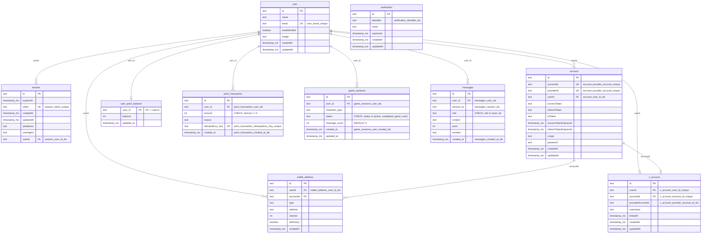

# DB設計（Drizzle Schema）

対象スキーマ:

- `src/infrastructure/db/schema/auth.ts`
- `src/infrastructure/db/schema/game-session.ts`
- `src/infrastructure/db/schema/message.ts`
- `src/infrastructure/db/schema/point.ts`

## 備考（better-auth）

- 以下は `better-auth` の基本テーブルです: `user`, `session`, `account`, `verification`
- `walletAddress` は `better-auth-web3` の default schema テーブルです（Mermaid 図では `wallet_address` 表記）
- `xAccount` は wallet ユーザーに紐づく X 連携情報テーブルです
- 以下はアプリ独自テーブルです: `game_sessions`, `messages`, `user_point_balance`, `point_transaction`
- `user.email` はアプリ表示用ではなく、`better-auth` / `better-auth-web3` の内部互換のため保持します（削除しない）

### `better-auth-web3` 運用ルール（重要）

- `anonymous=true`（default）: 新規ユーザー作成時、verify bodyで`email`を省略可能。未指定時は `emailDomainName ?? domain` と ENS/SNS 名または短縮ウォレットアドレスから疑似メールを生成して `user.email` に保存
- `anonymous=false` かつアクティブセッションなし: verify body に `email` 必須
- 署名フローは必ず `/web3/nonce` を先に呼ぶ。返却された nonce を署名メッセージに反映して verify する
- nonce は `type + walletAddress + value(chainId/cluster)` にバインドされ、失効は約15分

### チャット保存ルール（重要）

- `POST /api/chat` は `isInit` / `isInit:false` の両方で認証必須（未ログインは `401`）
- `isInit:true` の成功時、`game_sessions` に新規レコードを作成する（同日の active セッションがあれば resume）
- `isInit:true` で同日に `game_over` セッションがある場合は `403 GAME_OVER_BLOCKED` を返す
- `isInit:false` の成功時、`messages` に user/ai の2行を保存する
- `isInit:false` で `session.canChat` が false の場合は `403 CHAT_LIMIT_EXCEEDED` を返す
- `type: "message"` の場合、`point_transaction` に `reason="chat"` で加算記録する
- `messages` / `point` のDB保存失敗時はチャット応答を継続し、サーバーログへ出力する

### ゲームセッション管理ルール（重要）

- 各セッションは最大20メッセージ（`MAX_CHATS_PER_SESSION`）
- メッセージ処理時はまず `game_sessions.message_count` をインクリメントしてから NG ワード判定を行う
- NGワードヒット時は `status = 'game_over'` を設定し、これは `MAX_CHATS_PER_SESSION` 到達による `status = 'completed'` より優先する
- NGワード非ヒット時のみ、`game_sessions.message_count >= MAX_CHATS_PER_SESSION` なら `status = 'completed'`
- `status = 'game_over'` になった同日は新規セッション開始不可
- NGワードは `game_sessions` テーブルには保存せず、in-memory キャッシュ（`NgWordCache`）で管理
- 日付境界は UTC 基準

## ER図

## テーブル定義

### `user`

| Column          | Type                    | NULL | PK  | FK  | Index/Constraint                         |
| --------------- | ----------------------- | ---- | --- | --- | ---------------------------------------- |
| `id`            | `text`                  | NO   | YES | -   | -                                        |
| `name`          | `text`                  | YES  | -   | -   | -                                        |
| `email`         | `text`                  | YES  | -   | -   | `UNIQUE user_email_unique`（内部互換用） |
| `emailVerified` | `integer(boolean)`      | NO   | -   | -   | `DEFAULT false`                          |
| `image`         | `text`                  | YES  | -   | -   | -                                        |
| `createdAt`     | `integer(timestamp_ms)` | NO   | -   | -   | -                                        |
| `updatedAt`     | `integer(timestamp_ms)` | NO   | -   | -   | -                                        |

### `session`

| Column      | Type                    | NULL | PK  | FK        | Index/Constraint              |
| ----------- | ----------------------- | ---- | --- | --------- | ----------------------------- |
| `id`        | `text`                  | NO   | YES | -         | -                             |
| `expiresAt` | `integer(timestamp_ms)` | NO   | -   | -         | -                             |
| `token`     | `text`                  | NO   | -   | -         | `UNIQUE session_token_unique` |
| `createdAt` | `integer(timestamp_ms)` | NO   | -   | -         | -                             |
| `updatedAt` | `integer(timestamp_ms)` | NO   | -   | -         | -                             |
| `ipAddress` | `text`                  | YES  | -   | -         | -                             |
| `userAgent` | `text`                  | YES  | -   | -         | -                             |
| `userId`    | `text`                  | NO   | -   | `user.id` | `INDEX session_user_id_idx`   |

### `account`

| Column                  | Type                    | NULL | PK  | FK        | Index/Constraint                          |
| ----------------------- | ----------------------- | ---- | --- | --------- | ----------------------------------------- |
| `id`                    | `text`                  | NO   | YES | -         | -                                         |
| `accountId`             | `text`                  | NO   | -   | -         | `UNIQUE(account_provider_account_unique)` |
| `providerId`            | `text`                  | NO   | -   | -         | `UNIQUE(account_provider_account_unique)` |
| `userId`                | `text`                  | NO   | -   | `user.id` | `INDEX account_user_id_idx`               |
| `accessToken`           | `text`                  | YES  | -   | -         | -                                         |
| `refreshToken`          | `text`                  | YES  | -   | -         | -                                         |
| `idToken`               | `text`                  | YES  | -   | -         | -                                         |
| `accessTokenExpiresAt`  | `integer(timestamp_ms)` | YES  | -   | -         | -                                         |
| `refreshTokenExpiresAt` | `integer(timestamp_ms)` | YES  | -   | -         | -                                         |
| `scope`                 | `text`                  | YES  | -   | -         | -                                         |
| `password`              | `text`                  | YES  | -   | -         | -                                         |
| `createdAt`             | `integer(timestamp_ms)` | NO   | -   | -         | -                                         |
| `updatedAt`             | `integer(timestamp_ms)` | NO   | -   | -         | -                                         |

### `verification`

| Column       | Type                    | NULL | PK  | FK  | Index/Constraint                    |
| ------------ | ----------------------- | ---- | --- | --- | ----------------------------------- |
| `id`         | `text`                  | NO   | YES | -   | -                                   |
| `identifier` | `text`                  | NO   | -   | -   | `INDEX verification_identifier_idx` |
| `value`      | `text`                  | NO   | -   | -   | -                                   |
| `expiresAt`  | `integer(timestamp_ms)` | NO   | -   | -   | -                                   |
| `createdAt`  | `integer(timestamp_ms)` | YES  | -   | -   | -                                   |
| `updatedAt`  | `integer(timestamp_ms)` | YES  | -   | -   | -                                   |

### `walletAddress`

| Column      | Type                    | NULL | PK  | FK           | Index/Constraint                   |
| ----------- | ----------------------- | ---- | --- | ------------ | ---------------------------------- |
| `id`        | `text`                  | NO   | YES | -            | -                                  |
| `userId`    | `text`                  | NO   | -   | `user.id`    | `INDEX wallet_address_user_id_idx` |
| `accountId` | `text`                  | NO   | -   | `account.id` | -                                  |
| `type`      | `text`                  | NO   | -   | -            | `UNIQUE(wallet_address_unique)`    |
| `address`   | `text`                  | NO   | -   | -            | `UNIQUE(wallet_address_unique)`    |
| `chainId`   | `integer`               | YES  | -   | -            | `UNIQUE(wallet_address_unique)`    |
| `isPrimary` | `integer(boolean)`      | NO   | -   | -            | `DEFAULT false`                    |
| `createdAt` | `integer(timestamp_ms)` | NO   | -   | -            | -                                  |

### `xAccount`

| Column              | Type                    | NULL | PK  | FK           | Index/Constraint                          |
| ------------------- | ----------------------- | ---- | --- | ------------ | ----------------------------------------- |
| `id`                | `text`                  | NO   | YES | -            | -                                         |
| `userId`            | `text`                  | NO   | -   | `user.id`    | `UNIQUE x_account_user_id_unique`         |
| `accountId`         | `text`                  | NO   | -   | `account.id` | `UNIQUE x_account_account_id_unique`      |
| `providerAccountId` | `text`                  | NO   | -   | -            | `INDEX x_account_provider_account_id_idx` |
| `username`          | `text`                  | YES  | -   | -            | -                                         |
| `linkedAt`          | `integer(timestamp_ms)` | NO   | -   | -            | -                                         |
| `createdAt`         | `integer(timestamp_ms)` | NO   | -   | -            | -                                         |
| `updatedAt`         | `integer(timestamp_ms)` | NO   | -   | -            | -                                         |

### `game_sessions`

| Column           | Type                    | NULL | PK  | FK        | Index/Constraint                                                                         |
| ---------------- | ----------------------- | ---- | --- | --------- | ---------------------------------------------------------------------------------------- |
| `id`             | `text`                  | NO   | YES | -         | -                                                                                        |
| `user_id`        | `text`                  | NO   | -   | `user.id` | `INDEX game_sessions_user_idx`                                                           |
| `character_type` | `text`                  | NO   | -   | -         | -                                                                                        |
| `status`         | `text`                  | NO   | -   | -         | `DEFAULT 'active'`, `CHECK game_sessions_status_valid`, `INDEX game_sessions_status_idx` |
| `message_count`  | `integer`               | NO   | -   | -         | `DEFAULT 0`                                                                              |
| `created_at`     | `integer(timestamp_ms)` | NO   | -   | -         | `INDEX game_sessions_user_created_idx`                                                   |
| `updated_at`     | `integer(timestamp_ms)` | NO   | -   | -         | -                                                                                        |

### `user_point_balance`

| Column       | Type                    | NULL | PK  | FK        | Index/Constraint |
| ------------ | ----------------------- | ---- | --- | --------- | ---------------- |
| `user_id`    | `text`                  | NO   | YES | `user.id` | -                |
| `balance`    | `integer`               | NO   | -   | -         | `DEFAULT 0`      |
| `updated_at` | `integer(timestamp_ms)` | NO   | -   | -         | -                |

### `point_transaction`

| Column            | Type                    | NULL | PK  | FK        | Index/Constraint                                        |
| ----------------- | ----------------------- | ---- | --- | --------- | ------------------------------------------------------- |
| `id`              | `text`                  | NO   | YES | -         | -                                                       |
| `user_id`         | `text`                  | NO   | -   | `user.id` | `INDEX point_transaction_user_idx`                      |
| `amount`          | `integer`               | NO   | -   | -         | `CHECK point_transaction_amount_non_zero (amount <> 0)` |
| `reason`          | `text`                  | NO   | -   | -         | -                                                       |
| `idempotency_key` | `text`                  | YES  | -   | -         | `UNIQUE point_transaction_idempotency_key_unique`       |
| `created_at`      | `integer(timestamp_ms)` | NO   | -   | -         | `INDEX point_transaction_created_at_idx`                |

### `messages`

| Column       | Type                    | NULL | PK  | FK        | Index/Constraint                                    |
| ------------ | ----------------------- | ---- | --- | --------- | --------------------------------------------------- |
| `id`         | `text`                  | NO   | YES | -         | -                                                   |
| `user_id`    | `text`                  | NO   | -   | `user.id` | `INDEX messages_user_idx`                           |
| `session_id` | `text`                  | NO   | -   | -         | `INDEX messages_session_idx`                        |
| `role`       | `text`                  | NO   | -   | -         | `CHECK messages_role_valid (role in ('user','ai'))` |
| `content`    | `text`                  | NO   | -   | -         | -                                                   |
| `point`      | `integer`               | YES  | -   | -         | -                                                   |
| `emotion`    | `text`                  | YES  | -   | -         | -                                                   |
| `created_at` | `integer(timestamp_ms)` | NO   | -   | -         | `INDEX messages_created_at_idx`                     |

## インデックス一覧

| Table               | Name                                       | Type   | Columns                               |
| ------------------- | ------------------------------------------ | ------ | ------------------------------------- |
| `user`              | `user_email_unique`                        | UNIQUE | `email`                               |
| `session`           | `session_token_unique`                     | UNIQUE | `token`                               |
| `session`           | `session_user_id_idx`                      | INDEX  | `userId`                              |
| `account`           | `account_provider_account_unique`          | UNIQUE | `providerId`, `accountId`             |
| `account`           | `account_user_id_idx`                      | INDEX  | `userId`                              |
| `verification`      | `verification_identifier_idx`              | INDEX  | `identifier`                          |
| `walletAddress`     | `wallet_address_unique`                    | UNIQUE | `address`, `type`, `chainId`          |
| `walletAddress`     | `wallet_address_user_id_idx`               | INDEX  | `userId`                              |
| `xAccount`          | `x_account_user_id_unique`                 | UNIQUE | `userId`                              |
| `xAccount`          | `x_account_account_id_unique`              | UNIQUE | `accountId`                           |
| `xAccount`          | `x_account_provider_account_id_idx`        | INDEX  | `providerAccountId`                   |
| `game_sessions`     | `game_sessions_user_idx`                   | INDEX  | `user_id`                             |
| `game_sessions`     | `game_sessions_user_created_idx`           | INDEX  | `user_id`, `created_at`               |
| `game_sessions`     | `game_sessions_status_idx`                 | INDEX  | `status`                              |
| `messages`          | `messages_user_idx`                        | INDEX  | `user_id`                             |
| `messages`          | `messages_session_idx`                     | INDEX  | `session_id`                          |
| `messages`          | `messages_created_at_idx`                  | INDEX  | `created_at`                          |
| `messages`          | `messages_user_session_created_idx`        | INDEX  | `user_id`, `session_id`, `created_at` |
| `point_transaction` | `point_transaction_user_idx`               | INDEX  | `user_id`                             |
| `point_transaction` | `point_transaction_created_at_idx`         | INDEX  | `created_at`                          |
| `point_transaction` | `point_transaction_idempotency_key_unique` | UNIQUE | `idempotency_key`                     |
